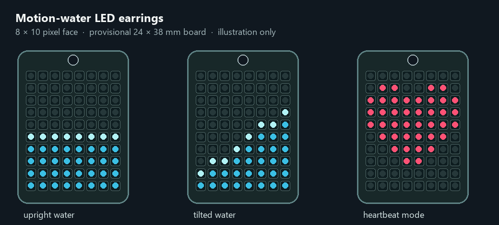

# Motion-water LED earrings

This repository contains a design-start package for a rechargeable pair of 8 × 10 RGB pixel earrings. The proposed first wearable revision adds an accelerometer so a blue waterline reacts to tilt. It is intended as a personal gift project.

- [Selected plan](FINAL_PLAN.md)
- [Rev B electrical architecture, net names and PCB study](hardware/rev_b/README.md)
- [ATtiny1616 firmware draft](firmware/rev_b/README.md)
- [Parametric rear tray and two-pocket dock](mechanical/rev_b/README.md)

**Build status:** no Rev B schematic has been captured in EasyEDA, no PCB has been routed, and no hardware measurements or firmware compile/upload have been completed. The SVG and CSV files are layout studies, not files for fabrication.
