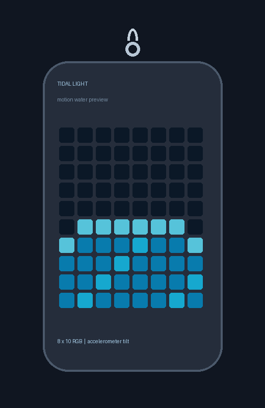

# Motion-water LED earrings

This repository contains a design-start package for a rechargeable pair of 8 × 10 RGB pixel earrings. The proposed first wearable revision adds an accelerometer so a blue waterline reacts to tilt. It is intended as a personal gift project.

- [Selected plan](FINAL_PLAN.md)
- [Rev B electrical architecture, net names and PCB study](hardware/rev_b/README.md)
- [Compiled ATtiny1616 firmware and animated water preview](firmware/rev_b/README.md)
- [Parametric cases and rendered STL fit dummies](mechanical/rev_b/README.md)
- [Home programming and first-article checks](PROGRAM_AND_TEST.md)
- [Editable EasyEDA Rev B project](https://easyeda.com/haldarsaurav123456/led-earrings-rev-b-motion-water)

**Build status:** EasyEDA contains a partial schematic with the MCU, accelerometer, charger, regulator and two LEDs, plus a provisional 26 × 42 mm PCB outline with five footprints. No electrical nets, 80-LED chain, final placement or routing have been completed. Firmware compiles and a `.hex` is included, but has not been flashed to hardware. The three STL files are fit dummies; the PCB and charging dock are not ready to fabricate or use.
