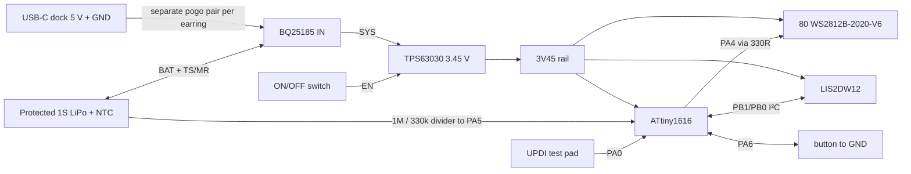

# Rev B — motion water earring, design-start package

**Status: architectural schematic and placement study, with a saved [EasyEDA Rev B project](https://easyeda.com/haldarsaurav123456/led-earrings-rev-b-motion-water) containing four sourced IC symbols and two LED symbols, and a provisional 26 × 42 mm PCB outline with five footprints. Not a complete schematic, routed PCB, manufacturing file, or order authorization.** The older `documents/LED_Earrings_RevA_Design_Package` is an independent ESP32-C3 / 10 × 10 concept; do not mix its netlist or charger into this revision.

## Decision for the first wearable prototype

| Item | Choice | Reason / check |
|---|---|---|
| Display | 8 × 10 WS2812B-2020-V6, 2.4 mm pitch | Dense pixel look while leaving a margin around 2 mm packages. Confirm LCSC/JLC part and footprint orientation. |
| Controller | ATtiny1616 | Already owned as a development breakout; 16 KB flash, 2 KB RAM, UPDI. Final board uses the bare IC. |
| Motion | LIS2DW12 3-axis accelerometer | Gravity gives the tilt needed for a level water surface. A gyro would require integration and more power. |
| Power | Akyga AKY0153 / LP402025, protected 1S 150 mAh, 20 × 25 × 4 mm, 5 g | PCM is built in. Verify actual delivered polarity, dimensions and charge/discharge limits; retain factory cell insulation. |
| Cell temperature | Vishay NTCAFLEX05103GL, 10 kΩ B3435 flex NTC | Fix insulated sensing head to the pouch with strain relief; verify TS/MR thresholds and charger suspension using real temperatures. |
| Charger | BQ25185 per earring, 5 V pogo input | Power path, programmable current, temperature input. Separate USB-C dock feeds each earring in parallel. |
| Regulator | TPS63030 adjustable buck-boost, nominal 3.45 V, forced PWM while on | Keeps LED, MCU and sensor on one compatible logic rail over cell discharge. This rail must be measured at both extremes; sensor maximum is 3.6 V. |
| User control | One button plus mechanical regulator enable switch | Button changes effect/brightness; switch gives true off while charging remains connected. |
| Body | 26 × 42 × 0.8 mm PCB study, 28 × 44 mm back tray | Front LEDs exposed; rear cell, NTC and electronics insulated by a removable cover. Dimensions are provisional. |

The regulator's forced-PWM feedback reference is nominally 0.5 V. A **study value** of 1.18 MΩ over 200 kΩ gives 3.45 V. Verify worst-case tolerance, switching compensation, inductor, input/output capacitors and thermal behavior from the exact TI datasheet and a test circuit before capture. The 2020 V6 LED family is specified from 3.3 V; the LIS2DW12 is specified up to 3.6 V. Do not use the regulator's power-save mode without checking its wider output tolerance.

## Schematic connectivity to capture in EasyEDA

### Named nets

| Net | From | To / note |
|---|---|---|
| DOCK_5V | Rear pad P1 | BQ25185 IN; add input protection/decoupling per TI application schematic. |
| GND | Rear pad P2 | Charger, regulator, MCU, sensor, every LED and battery minus. |
| BAT | Protected cell positive | BQ25185 BAT and battery divider top. Confirm protection and NTC wiring with actual cell. |
| SYS | BQ25185 SYS | TPS63030 VIN/VINA. Do not join directly to 3V45. |
| 3V45 | TPS63030 VOUT | MCU VDD, LIS2DW12 VDD/VDDIO, LED VDD, I²C pull-ups. |
| LED_DATA_0 | PA4 through 330 Ω | LED01 DIN. Each DOUT connects to next DIN through `LED_DATA_1…79`. |
| SCL/SDA | PB0/PB1 | LIS2DW12 pins 1/4, with 10 kΩ pull-ups to 3V45. CS high; SA0 low. |
| BTN | PA6 | Button to GND, MCU internal pull-up. |
| VBAT_SENSE | PA5 | 1 MΩ from BAT, 330 kΩ to GND. |
| UPDI | PA0 | Rear programming pad P3; pad is not wired in gift charging dock. |
| VTG_3V45 | 3V45 | Rear programming voltage-sense pad P4. The programmer must not drive this pad. No contact in gift dock. |
| TS_NTC | Vishay flex NTC on cell pouch | BQ25185 TS/MR. Confirm exact bias/connection from TI datasheet and verify temperature lockout. |

Place at least 100 nF close to every IC supply, bulk capacitance at LED supply injection and regulator input/output capacitors exactly as the selected TI circuit requires. The LED data chain is serpentine from the **top-left**; the generated CSV lists all 80 coordinate-to-index mappings. Keep a continuous ground plane where routing allows. The hook hole needs copper and component clearance and must carry load through the FR-4, not a solder joint.

### Power IC capture checklist

| Device | Pin-level starting connections | Value status |
|---|---|---|
| BQ25185 | IN pin 10 = DOCK_5V; SYS pin 1 = SYS; BAT pin 2 = BAT; GND pin 5 and thermal pad = GND; `/CE` pin 4 = GND; STAT1 pin 9 / STAT2 pin 3 initially available for test. | TI table gives **24 kΩ** on ILIM/VSET pin 7 for 4.2 V cell charging with 100 mA input limit. A **10 kΩ** ISET pin 8 resistor targets about 30 mA charge. TI recommends extra ISET compensation below 50 mA: resolve exact circuit before PCB release. TS/MR pin 6 connects to the pouch-mounted NTC; verify open/short and cold/hot inhibition. |
| TPS63030 | VIN pin 5 and VINA pin 8 = SYS; VOUT pin 1 = 3V45; L1 pin 4 / L2 pin 2 span the specified inductor; GND pin 9, PGND pin 3 and thermal pad = GND; PS/SYNC pin 7 = SYS for forced PWM. | EN pin 6 is switched between SYS (on) and GND (off); no floating state. FB pin 10 takes a proposed 1.18 MΩ top / 200 kΩ bottom divider for nominal 3.45 V. Match inductor and capacitors to TI's application circuit, then measure the output tolerance. |

The dock carries only 5 V and ground to each earring's charger. It must not connect its 5 V contact to BAT, SYS or 3V45. The earring on/off switch disables the regulator, leaving the charger connected so the cell can charge while the lights are off.

## PCB study and files

For a quick first-draft view, open [schematic_draft.svg](schematic_draft.svg) for the one-earring power, control and LED connections, then [board_study.svg](board_study.svg) for the proposed front/back layout. These are review drawings, not the native orderable PCB.

Run `python generate_study.py` to regenerate:

- `placements.csv`: mechanical LED centres and provisional rear block centres, in mm from the upper-left board corner.
- `led_chain.csv`: explicit 80-pixel serpentine order and net labels.
- `board_study.svg`: front/back concept map. The rear rectangles are **space reservations**, not real footprints.

**EasyEDA status:** the named project is saved in the user's account. The ATtiny1616-MNR, ST LIS2DW12TR, TI BQ25185DLHR, TI TPS63030DSKR and two Worldsemi WS2812B-2020-V6 symbols are on the schematic. A converted 26 × 42 mm two-layer PCB document contains five footprints, still outside the board outline. The schematic has no completed nets and the PCB has no placement or routing. The pin-by-pin [capture contract](PIN_CONNECTIONS.md) and [draft BOM](bom_draft.csv) are local files. The LED library footprint is named `WS2815C-2020-4P`; confirm exact pad size and pin orientation from the Worldsemi part before creating the other 78. Never order from `board_study.svg` or the partial EasyEDA project.

## Release gates before any PCB order

1. Obtain the selected Akyga cell and Vishay NTC. Confirm delivered polarity and cell ratings, fit the NTC against the pouch, then bench-test the proposed 30 mA BQ25185 charge setting, low-current compensation, TS/MR cutoff, termination and system-off behavior.
2. Buy a few exact WS2812B-2020-V6 LEDs and a LIS2DW12 breakout. Confirm LED pinout, color order, 3.45 V operation, I²C axes and the animation on a current-limited prototype.
3. Measure supply current in water, heart, sparkle, rainbow, startup, low battery and switch-off. Measure cell voltage sag, regulator voltage and skin-side temperature. Target at least two useful hours; revise brightness, cell or pixel count if measurements disagree.
4. Print the 26 × 42 mm dummy and rear tray, then weigh and wear-test with the actual cell and a 316L hook. Check button/switch access, flex, hook pull strength, charging alignment and service-pad access.
5. Capture exact components in EasyEDA, run ERC, convert to PCB, route and run DRC. Inspect every LED DIN/DOUT pin, solder mask slivers, regulator switching loop, thermal pad, dock polarity and hook clearance. Have a second net-by-net review before exporting Gerbers/BOM/CPL.
6. Order **one small prototype batch**, assemble one board, validate electrical and thermal behavior, and only then finish the matched pair and charging dock.

## Primary component references

- [Worldsemi WS2812B-2020-V6](https://www.world-semi.com/products/ws2812b-2020-v6.html)
- [Microchip ATtiny1616](https://www.microchip.com/en-us/product/ATTINY1616)
- [ST LIS2DW12 datasheet](https://www.st.com/resource/en/datasheet/lis2dw12.pdf)
- [TI BQ25185](https://www.ti.com/product/BQ25185)
- [TI TPS63030](https://www.ti.com/product/TPS63030)
- [Akyga AKY0153 battery](https://b2b.akyga.com/en/eacuxxxaky-08771-aky0153.html)
- [Vishay NTCAFLEX05103GL datasheet](https://www.vishay.com/doc/?29132=)
